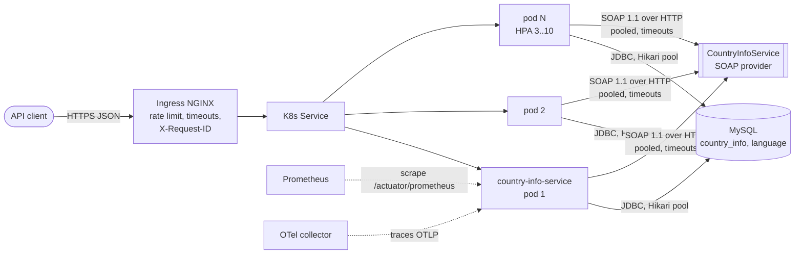
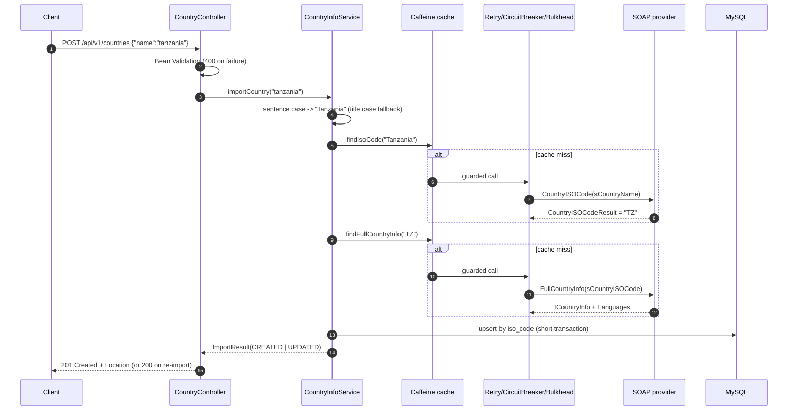

# Architecture and Design Decisions

## 1. Context

`country-info-service` exposes a clean JSON/REST API over a legacy SOAP provider
([oorsprong CountryInfoService](http://webservices.oorsprong.org/websamples.countryinfo/CountryInfoService.wso?WSDL)),
persists the results in MySQL and provides CRUD over the stored records.

## 2. Request flow (import a country)

If the provider is unavailable (timeout, 5xx, circuit open) and we already hold the
country, the stored copy is returned with `200` and `X-Data-Source: local-store`
(graceful degradation). Otherwise the client gets `503`/`504` with `Retry-After`.

## 3. Layering (MVC + ports and adapters)

| Layer | Package | Responsibility |
|---|---|---|
| **Controller** | `web.controller` | HTTP mapping, validation, status codes. No business logic. |
| **View / DTO** | `web.dto` | API contract (records). Entities never serialised. |
| **Errors** | `web.error` | One `@RestControllerAdvice` producing RFC 9457 `application/problem+json`. |
| **Cross-cutting** | `web.filter` | Correlation id + structured access log. |
| **Service** | `service` | Use cases: import/upsert, CRUD, name normalisation, mapping. |
| **Model** | `model` | JPA entities `CountryInfo` 1-* `Language`. |
| **Repository** | `repository` | Spring Data JPA. |
| **Integration port** | `integration.CountryInfoClient` | Interface the service depends on. |
| **SOAP adapter** | `integration.soap` | Spring-WS client, resilience, mapping from generated JAXB types. |

The service depends on the `CountryInfoClient` **port**, not on SOAP. Generated JAXB
classes never leave `integration.soap` (anti-corruption layer), so a provider change
is contained in one class.

## 4. Key decisions and trade-offs

| Decision | Why | Trade-off / alternative |
|---|---|---|
| **Contract-first SOAP client**: JAXB generated at build time from the WSDL checked into `src/main/resources/wsdl` | Type-safe, compile-time breakage if the contract changes; builds do not depend on the remote WSDL being up | Regenerate when the provider changes its WSDL |
| **Spring-WS `WebServiceTemplate`** over Apache CXF | Lightweight, idiomatic in Spring Boot, easy to test with `MockWebServiceServer` | CXF has more WS-* features (WS-Security etc.) not needed here |
| **Pooled HttpClient 5** with explicit connect (2s) / read (4s) timeouts and 50 connections per route | Default per-route limit is 2, which would serialise traffic to the single upstream host under load | Values are config, tune per environment |
| **Sentence case, then Title Case fallback** | The brief asks for sentence case, but the provider is case-sensitive: `"United states"` is unknown while `"United States"` resolves | One extra (cached) SOAP call for multi-word names |
| **"Not found" detected in-band** | The provider returns `"No country found by that name"` as a normal result, not a SOAP fault. We validate `^[A-Z]{2}$` | Not-found never trips the circuit breaker |
| **Upsert by ISO code** (natural key, unique index) | `POST` is idempotent per country: re-import refreshes rather than duplicating | Re-import returns `200`, first import `201` |
| **SOAP calls outside DB transactions** | A slow provider must never hold a pooled DB connection or row locks | Upsert handles the concurrent-insert race with one retry on unique-key violation |
| **Optimistic locking** (`@Version`) | Safe concurrent `PUT`s across replicas without DB locks; conflicts return `409` | Clients retry on `409` |
| **Language diffing** on update (by ISO code) | Hibernate flushes inserts before deletes; clear-and-re-add would violate `(country_id, iso_code)` uniqueness | Slightly more code in the entity |
| **Flyway** owns the schema; Hibernate `validate` only | Versioned, reviewable migrations; safe with N replicas (Flyway takes a DB lock) | |
| **Caffeine (in-process) cache**, 12h TTL, 10k entries | Country data is near-static; a local cache removes a network hop and survives upstream outages | Each pod warms its own cache. If cross-pod consistency mattered, use Redis (`spring-boot-starter-data-redis`, same `@Cacheable`) |
| **No message queue** | The import is a short, synchronous request/response and the client needs the result | For bulk imports (e.g. all 250 countries) publish jobs to Kafka/RabbitMQ and process asynchronously with a `202 Accepted` + status resource |
| **Stateless pods** | No session or local state besides a disposable cache, so pods are freely scaled and rescheduled | |

## 5. Scalability

- **Horizontal scaling**: stateless pods behind a ClusterIP Service; HPA on CPU (70%)
  and memory (80%), 3..10 replicas, fast scale-up and a 5-minute scale-down window.
- **Load balancing**: Ingress NGINX at the edge (with per-client rate limiting), kube-proxy
  across pods.
- **Back-pressure**: Bulkhead (50 concurrent upstream calls, 100 ms queue wait) protects
  Tomcat threads when the provider slows down; Hikari pool sized per pod
  (`replicas x pool` stays below MySQL `max_connections`).
- **Read path** (`GET`) never touches the provider and is served from MySQL with
  pagination (max page size 100) and batch fetching of languages (no N+1 queries).
- **Database**: single writer is ample for this workload; add read replicas or move to
  a managed HA MySQL in production.
- **Zero-downtime deploys**: `maxUnavailable: 0`, readiness gates, `preStop` delay plus
  Spring graceful shutdown, PodDisruptionBudget, topology spread across nodes/zones.

## 6. Resilience

| Mechanism | Configuration | Effect |
|---|---|---|
| Timeouts | connect 2s, read 4s | No request waits indefinitely on the provider |
| Retry | 3 attempts, exponential backoff 200 ms x2; only I/O and HTTP 5xx | Absorbs transient blips. SOAP faults and circuit-open are not retried |
| Circuit breaker | 20-call window, opens at 50% failures or 80% slow calls (>3s), 30s open, 3 half-open probes | Fails fast during an outage and protects the provider while it recovers |
| Bulkhead | 50 concurrent calls | A slow provider cannot exhaust request threads |
| Cache | Checked **before** the resilience chain (`@EnableCaching(order = HIGHEST_PRECEDENCE)`) | Cached answers are served even while the circuit is open |
| Fallback | Stored copy from MySQL | `200` + `X-Data-Source: local-store` instead of an error |
| Error mapping | `503` unavailable (+`Retry-After`), `504` timeout, `502` bad upstream response | Callers can tell transient from permanent failures |

Readiness deliberately does **not** include the SOAP provider: an upstream outage
would otherwise mark every pod unready and take the stored-data fallback down with it.
Circuit-breaker state is still visible at `/actuator/health` and `/actuator/circuitbreakers`.

## 7. Observability

- **Structured logs**: ECS JSON (`LOGGING_STRUCTURED_FORMAT_CONSOLE=ecs`) with
  `traceId`, `spanId`, `requestId` and domain key-values (`isoCode`, `outcome`,
  `operation`, `reason`). Ready for Loki/ELK/Cloud Logging without parsing rules.
- **Correlation**: `X-Request-ID` accepted from the caller/ingress (validated), generated
  otherwise, echoed in responses and included in every error body.
- **Metrics** (`/actuator/prometheus`):
  - `http_server_requests_seconds` (histograms: p50/p95/p99 per endpoint and status)
  - `countryinfo_soap_client_seconds{operation,error}` (upstream latency and errors)
  - `countryinfo_imports_total{outcome}` (CREATED, UPDATED, NOT_FOUND, SERVED_STALE, UPSTREAM_*)
  - `resilience4j_circuitbreaker_state`, `resilience4j_retry_calls_total`, `resilience4j_bulkhead_*`
  - `cache_gets_total{cache,result}` (hit ratio), `hikaricp_connections_*`, JVM metrics
- **Tracing**: Micrometer Observation + OpenTelemetry; each SOAP call is a child span.
  Export via OTLP by setting `MANAGEMENT_OPENTELEMETRY_TRACING_EXPORT_OTLP_ENDPOINT`.
- **Health**: `/actuator/health/liveness` (JVM alive), `/actuator/health/readiness`
  (accepting traffic + DB reachable).

Suggested alerts: circuit open > 1 min; `countryinfo_imports_total{outcome=~"UPSTREAM_.*"}`
rate rising; p95 latency > 2s; 5xx ratio > 1%; Hikari pending connections > 0 sustained.

## 8. Security considerations

Implemented: input validation and size limits, no stack traces or internals in responses,
log-injection-safe request ids, non-root read-only container, restricted Pod Security
Standard, no service-account token, NetworkPolicy (ingress controller and Prometheus in;
DNS, MySQL and HTTP(S) out), secrets kept out of the image and ConfigMap, actuator not
exposed through the ingress.

Next steps for production: OAuth2/JWT resource server (or API-gateway auth), TLS
everywhere (the public provider is HTTP only, so egress through a proxy if policy
requires), secrets from Vault/External Secrets, image signing and scanning in CI.
